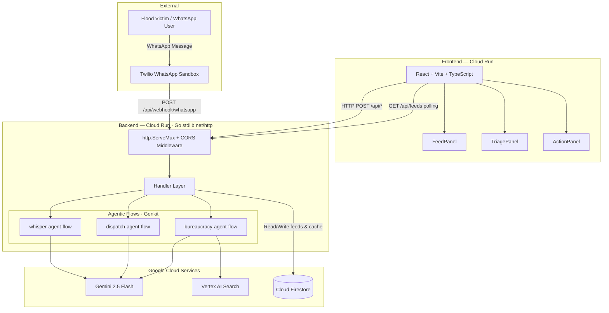
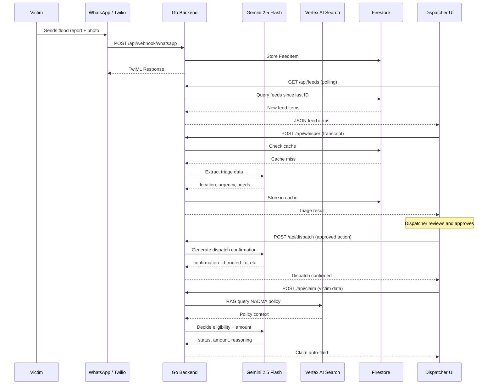
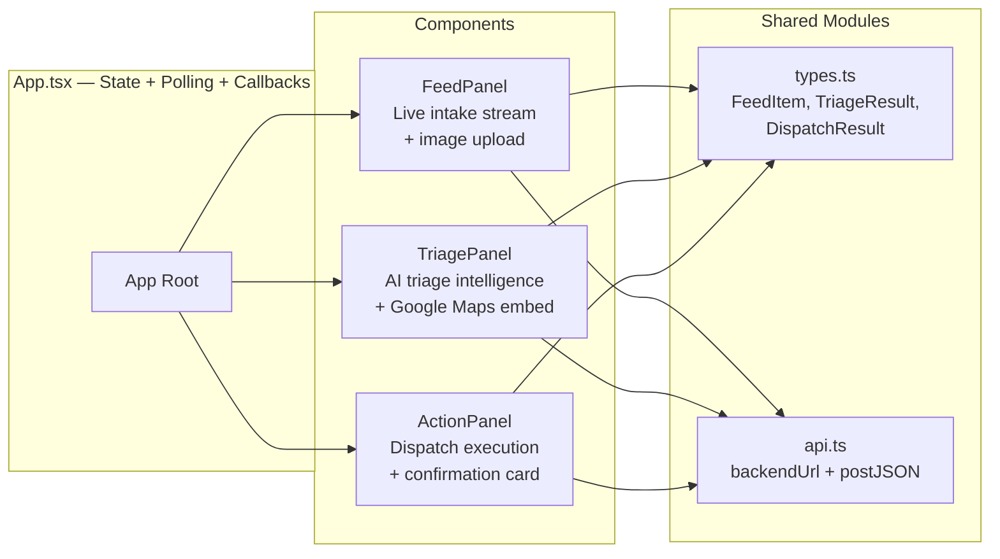

# FloodGuard Copilot 🚤🌊

**Built for Project 2030: MyAI Future Hackathon**
**Track:** Track 2: Citizens First (GovTech & Digital Services)

## 💡 The Problem
During Malaysia's annual floods, the transition to "End-to-End" digital government services faces literal friction. Dispatch centers are overwhelmed with frantic calls and low-bandwidth WhatsApp images. Post-rescue, shattered victims must face the bureaucratic friction of manually filling out damage claims for government relief.

## 🦸‍♂️ The Solution: Human-in-the-Loop Agentic AI
**FloodGuard Copilot** shifts AI from being a cold, customer-facing chatbot to an empowering "Invisible Hero" for human dispatchers and NGO rescue coordinators.

The platform ensures that stressed victims speak to an empathetic human, while the Agentic AI autonomously handles the heavy lifting:
- **Triage Extraction:** Gemini instantly extracts Location, Urgency, and Medical Needs from live rescue calls.
- **Visual Depth Estimation:** Gemini Pro Vision evaluates WhatsApp images of flood conditions to dynamically reroute and prioritize rescue boats.
- **The "Zero-Paperwork" Claim:** Once at a shelter, the dispatcher dictates the victim's identity. The backend queries **Vertex AI Search** via RAG against official MyDIGITAL blueprints and autonomously files the RM1,000 disaster relief claim.
- **Dispatch Execution:** Approved actions are executed by a Dispatch Agent that generates confirmation IDs, routes to nearest units, and provides ETAs.
- **WhatsApp Ingestion:** Real-time flood reports arrive via Twilio WhatsApp webhook, instantly appearing in the live feed.

---

## 🛠️ Tech Stack

| Layer | Technology |
|-------|-----------|
| **AI Intelligence** | Gemini 2.5 Flash (transcription parsing, image evaluation, dispatch reasoning) |
| **AI Orchestrator** | Firebase Genkit (Go SDK) — structured agentic workflows |
| **RAG Grounding** | Vertex AI Search (Discovery Engine API) — government policy retrieval |
| **Database** | Cloud Firestore (Native mode, `asia-southeast1`) — persistent feeds & response cache |
| **WhatsApp** | Twilio WhatsApp Sandbox — real-time message ingestion |
| **Backend** | Go 1.26 stdlib `net/http` — zero-framework, modular packages |
| **Frontend** | React 19 + TypeScript + Vite — component-based architecture |
| **Deployment** | Google Cloud Run (Docker multi-stage builds) |
| **Dev Tools** | Google Antigravity / Google AI Studio / GitHub Copilot |

---

## 🏗️ Architecture Diagram



---

## 🔁 Agentic Workflow — Sequence Diagram



---

## 🧱 Component Architecture — Frontend



---

## 🧩 API Endpoints

| Method | Endpoint | Description |
|--------|----------|-------------|
| `POST` | `/api/whisper` | Extract triage data from emergency call transcripts |
| `POST` | `/api/triage` | Analyze WhatsApp messages and flood images |
| `POST` | `/api/claim` | Process disaster relief claims with RAG grounding |
| `POST` | `/api/dispatch` | Execute approved dispatch or claim filing action |
| `POST` | `/api/webhook/whatsapp` | Receive incoming WhatsApp messages via Twilio |
| `GET`  | `/api/feeds` | Poll for new feed items (`?since=<id>` for incremental) |

---

## 🔄 Agentic Flows

1. **whisper-agent-flow** — Emergency transcript → Gemini extracts `{location, urgency, needs, suggested_action, status}` → Returns payload for human approval.
2. **bureaucracy-agent-flow** — Victim data → Vertex AI Search for NADMA policy (RAG) → Gemini decides eligibility & amount → Auto-files claim.
3. **dispatch-agent-flow** — Approved action → Gemini generates `{confirmation_id, routed_to, eta_minutes, summary}` → Execution confirmed.
4. **WhatsApp webhook** — Twilio delivers messages → stored in Firestore → frontend polls for new feeds every 3 seconds.

---

## 💾 Data Persistence (Cloud Firestore)

| Collection | Purpose | Document Key |
|-----------|---------|-------------|
| `feeds` | Incoming messages (WhatsApp, calls, claims) | Feed item ID (e.g. `wa-1713...`) |
| `cache` | Gemini response cache (avoids redundant API calls) | SHA-256 hash of `flow:input` |

Feeds are ordered by `createdAt` (millisecond timestamp) for efficient incremental polling. The cache exploits Gemini's `temperature=0` determinism — identical inputs always produce identical outputs.

---

## 🚀 Setup Instructions

### Prerequisites
- Node.js 20+
- Go 1.26+
- Google Cloud CLI (`gcloud`)
- A valid `GEMINI_API_KEY` from Google AI Studio

### Local Backend Setup (Go)
```bash
cd backend
export GEMINI_API_KEY="your_api_key_here"
export GOOGLE_CLOUD_PROJECT="your-gcp-project-id"
go run main.go
# Server starts on http://localhost:3400
```

### Local Frontend Setup (React)
```bash
cd frontend
npm install
npm run dev
# UI accessible at http://localhost:5173
```

---

## ☁️ Cloud Run Deployment

```bash
# Backend
cd backend
gcloud run deploy floodguard-backend \
  --source . --region asia-southeast1 \
  --project projectName

# Frontend
cd frontend
gcloud run deploy floodguard-frontend \
  --source . --region asia-southeast1 \
  --project projectName
```

Cloud Run auto-authenticates with Firestore (same project) — no credentials file needed.

---

## 📁 Project Structure

```
PROJECT2030/
├── backend/
│   ├── main.go                         # Entry point: Firestore init, Genkit init, server start
│   ├── Dockerfile                      # Multi-stage Go build for Cloud Run
│   ├── go.mod                          # Go module dependencies
│   └── internal/
│       ├── flows/
│       │   └── register.go             # Genkit AI flows (whisper, bureaucracy, dispatch)
│       ├── handler/
│       │   └── handler.go              # HTTP handlers for all 6 API endpoints
│       ├── middleware/
│       │   └── cors.go                 # CORS middleware (stdlib http.Handler)
│       ├── models/
│       │   └── models.go               # Shared types (FeedItem, request structs)
│       ├── search/
│       │   └── vertexai.go             # Vertex AI Search / Discovery Engine RAG
│       └── store/
│           ├── cache.go                # Firestore-backed Gemini response cache
│           └── feeds.go                # Firestore-backed feed item store
├── frontend/
│   ├── src/
│   │   ├── App.tsx                     # Root composition (state, polling, callbacks)
│   │   ├── App.css                     # Glassmorphism dark theme + responsive styles
│   │   ├── main.tsx                    # React entry point
│   │   ├── types.ts                    # Shared TypeScript interfaces
│   │   ├── api.ts                      # Backend URL helper + postJSON utility
│   │   └── components/
│   │       ├── FeedPanel.tsx           # Left panel: live intake stream + image upload
│   │       ├── TriagePanel.tsx         # Center panel: AI intelligence display + map
│   │       └── ActionPanel.tsx         # Right panel: dispatch execution + confirmation
│   ├── Dockerfile                      # Multi-stage build (Nginx) for Cloud Run
│   └── package.json                    # Node dependencies
└── docs/
    └── antigravity_artifacts/          # Google Antigravity planning docs
```

---

## 🤖 AI Generation Disclosure
*Per Section 4 (Code of Conduct & Plagiarism Policy):*
The foundational architecture, UI components, and Go REST integration for this project were developed via pair-programming with the **Google Antigravity AI Coding Assistant** and **GitHub Copilot** using the Google AI ecosystem stack. The primary scaffolding was AI-generated, while specific agentic flows, deployment constraints, and logic structuring were guided and validated entirely by the hackathon team. The team can explain and defend all parts of the codebase.

---