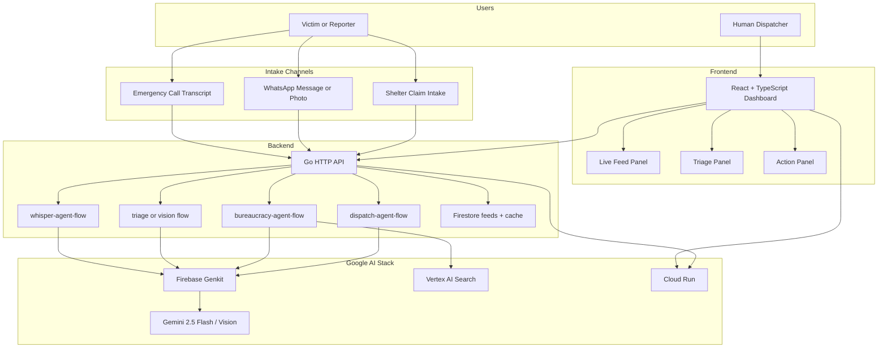
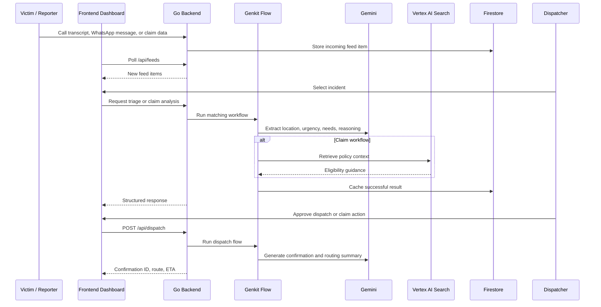

# FloodGuard Copilot Submission Notes

This file contains the architecture summary and judging-alignment notes for submission. It is intentionally stored at the repository root because the `docs/` directory is excluded from version control.

## Project Summary

FloodGuard Copilot is a human-in-the-loop emergency response platform for flood rescue coordination in Malaysia. It helps dispatchers process emergency calls, WhatsApp reports, and post-rescue relief claims faster by combining Gemini-powered extraction, Genkit workflows, Vertex AI Search grounding, and a React dispatch dashboard.

## Architecture Overview

## Operational Flow

## Core Capabilities

### 1. Whisper Agent for Calls

- Parses emergency call transcripts into structured triage data.
- Extracts location, urgency, medical needs, and suggested action.
- Keeps a human dispatcher in control before any dispatch is executed.

### 2. Low-Bandwidth WhatsApp Triage

- Handles text and image-based incident intake.
- Uses Gemini vision reasoning to interpret flood context from uploaded photos.
- Surfaces new incidents into a live dispatch feed for rapid review.

### 3. Zero-Paperwork Relief Claim

- Uses a claim workflow to assess post-disaster aid eligibility.
- Grounds decisions with Vertex AI Search over policy context.
- Reduces administrative friction for victims already affected by flood damage.

## Judging Criteria Alignment

### AI Implementation and Technical Execution

- Uses multiple agentic workflows in Firebase Genkit rather than a single prompt call.
- Combines Gemini extraction, multimodal analysis, dispatch generation, and RAG-supported claim review.
- Persists incoming feeds and successful model outputs through Firestore-backed storage and caching.
- Deploys frontend and backend as production-ready Cloud Run services.

### Innovation and Creativity

- Positions AI as a dispatcher copilot instead of a victim-facing chatbot.
- Balances automation with human approval for high-stakes rescue decisions.
- Unifies rescue logistics and post-disaster claim handling in a single workflow.

### Impact and Problem Relevance

- Directly addresses flood response bottlenecks in Malaysia.
- Supports both immediate rescue coordination and later aid processing.
- Fits the Citizens First theme by reducing operational delay and bureaucratic burden.

### UI/UX and Presentation

- Presents incidents, AI triage, and execution actions in a single operator dashboard.
- Supports rapid review with a live feed, highlighted urgency, and action-oriented summaries.
- Includes demo-friendly flows for call intake, WhatsApp triage, and claim handling.

## Google Stack Alignment

- Gemini: structured extraction, multimodal image reasoning, and dispatch response generation.
- Firebase Genkit: orchestration layer for the agentic workflows.
- Vertex AI Search: retrieval grounding for claim and policy reasoning.
- Firestore: persistent feed store and workflow cache.
- Cloud Run: deployment target for both frontend and backend.